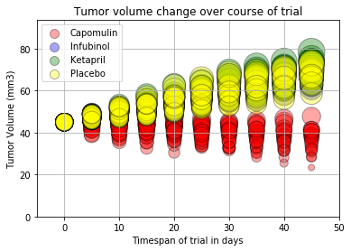
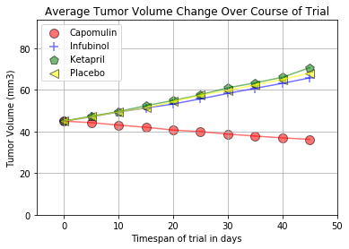
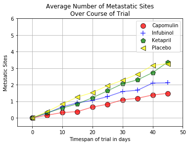
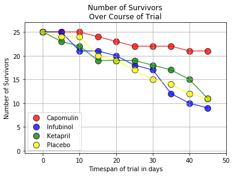
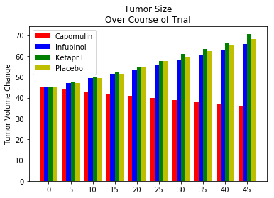
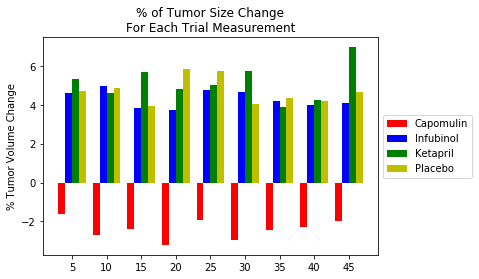
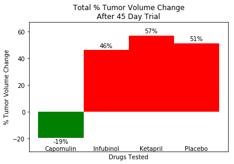

```python
#Colleen Karnas-Haines
#3/19/2018
#Pharmaceutical Analysis
```
#Observations:
#1. In this data set we see that Infubinol, Ketapril, and the Placebo all have
#tumor growth of the 45 day trial. Only Capomulin has a reduction in tumor #volume
#2. All four groups experienced an increase in metastatic sites, but 
#Capomulin had the least of the four. The Placebo (control group) had the 
#the most metastatic sites until day 45 when Ketapril jumped ahead
#3. While Infubinol had the second fewest metastatic sites after the 45 days
#and the second smallest tumor volume growth, it resulted in the highest
#mortality rate.

```python
#Dependencies
import matplotlib.pyplot as plt
import pandas as pd
import numpy as np
import os
import seaborn as sns
```


```python
#read in the two csv files
csvpath=os.path.join("raw_data","clinicaltrial_data.csv")
trial_data=pd.read_csv(csvpath)

csvpath=os.path.join("raw_data","mouse_drug_data.csv")
mouse_data=pd.read_csv(csvpath)
```


```python
#check the data
#drop mice that are duplicated
mouse_data.drop_duplicates(subset=["Mouse ID"], keep='first', inplace=True)
mouse_data.head()
#mouse_data.count()
```


<div>
<style>
    .dataframe thead tr:only-child th {
        text-align: right;
    }

    .dataframe thead th {
        text-align: left;
    }

    .dataframe tbody tr th {
        vertical-align: top;
    }
</style>
<table border="1" class="dataframe">
  <thead>
    <tr style="text-align: right;">
      <th></th>
      <th>Mouse ID</th>
      <th>Drug</th>
    </tr>
  </thead>
  <tbody>
    <tr>
      <th>0</th>
      <td>f234</td>
      <td>Stelasyn</td>
    </tr>
    <tr>
      <th>1</th>
      <td>x402</td>
      <td>Stelasyn</td>
    </tr>
    <tr>
      <th>2</th>
      <td>a492</td>
      <td>Stelasyn</td>
    </tr>
    <tr>
      <th>3</th>
      <td>w540</td>
      <td>Stelasyn</td>
    </tr>
    <tr>
      <th>4</th>
      <td>v764</td>
      <td>Stelasyn</td>
    </tr>
  </tbody>
</table>
</div>


```python
#Check data
trial_data.head()
#trial_data.count()
```


<div>
<style>
    .dataframe thead tr:only-child th {
        text-align: right;
    }

    .dataframe thead th {
        text-align: left;
    }

    .dataframe tbody tr th {
        vertical-align: top;
    }
</style>
<table border="1" class="dataframe">
  <thead>
    <tr style="text-align: right;">
      <th></th>
      <th>Mouse ID</th>
      <th>Timepoint</th>
      <th>Tumor Volume (mm3)</th>
      <th>Metastatic Sites</th>
    </tr>
  </thead>
  <tbody>
    <tr>
      <th>0</th>
      <td>b128</td>
      <td>0</td>
      <td>45.0</td>
      <td>0</td>
    </tr>
    <tr>
      <th>1</th>
      <td>f932</td>
      <td>0</td>
      <td>45.0</td>
      <td>0</td>
    </tr>
    <tr>
      <th>2</th>
      <td>g107</td>
      <td>0</td>
      <td>45.0</td>
      <td>0</td>
    </tr>
    <tr>
      <th>3</th>
      <td>a457</td>
      <td>0</td>
      <td>45.0</td>
      <td>0</td>
    </tr>
    <tr>
      <th>4</th>
      <td>c819</td>
      <td>0</td>
      <td>45.0</td>
      <td>0</td>
    </tr>
  </tbody>
</table>
</div>


```python
#Merge the mouse and clinical trial data
total_data = pd.merge(trial_data,mouse_data, on="Mouse ID", how="left")
```


```python
#Get rid of the extra drugs that we are not comparing
total_data = total_data[(total_data["Drug"]== "Placebo")|(total_data["Drug"]== "Capomulin")|(total_data["Drug"]== "Infubinol")|
                        (total_data["Drug"]== "Ketapril")]
total_data.head()
```


<div>
<style>
    .dataframe thead tr:only-child th {
        text-align: right;
    }

    .dataframe thead th {
        text-align: left;
    }

    .dataframe tbody tr th {
        vertical-align: top;
    }
</style>
<table border="1" class="dataframe">
  <thead>
    <tr style="text-align: right;">
      <th></th>
      <th>Mouse ID</th>
      <th>Timepoint</th>
      <th>Tumor Volume (mm3)</th>
      <th>Metastatic Sites</th>
      <th>Drug</th>
    </tr>
  </thead>
  <tbody>
    <tr>
      <th>0</th>
      <td>b128</td>
      <td>0</td>
      <td>45.0</td>
      <td>0</td>
      <td>Capomulin</td>
    </tr>
    <tr>
      <th>1</th>
      <td>f932</td>
      <td>0</td>
      <td>45.0</td>
      <td>0</td>
      <td>Ketapril</td>
    </tr>
    <tr>
      <th>2</th>
      <td>g107</td>
      <td>0</td>
      <td>45.0</td>
      <td>0</td>
      <td>Ketapril</td>
    </tr>
    <tr>
      <th>3</th>
      <td>a457</td>
      <td>0</td>
      <td>45.0</td>
      <td>0</td>
      <td>Ketapril</td>
    </tr>
    <tr>
      <th>4</th>
      <td>c819</td>
      <td>0</td>
      <td>45.0</td>
      <td>0</td>
      <td>Ketapril</td>
    </tr>
  </tbody>
</table>
</div>


```python
#Get the mice into order by name, then Timepoint
total_data=total_data.sort_values(by=["Mouse ID","Timepoint"])
total_data.head()
```


<div>
<style>
    .dataframe thead tr:only-child th {
        text-align: right;
    }

    .dataframe thead th {
        text-align: left;
    }

    .dataframe tbody tr th {
        vertical-align: top;
    }
</style>
<table border="1" class="dataframe">
  <thead>
    <tr style="text-align: right;">
      <th></th>
      <th>Mouse ID</th>
      <th>Timepoint</th>
      <th>Tumor Volume (mm3)</th>
      <th>Metastatic Sites</th>
      <th>Drug</th>
    </tr>
  </thead>
  <tbody>
    <tr>
      <th>113</th>
      <td>a203</td>
      <td>0</td>
      <td>45.000000</td>
      <td>0</td>
      <td>Infubinol</td>
    </tr>
    <tr>
      <th>389</th>
      <td>a203</td>
      <td>5</td>
      <td>48.508468</td>
      <td>0</td>
      <td>Infubinol</td>
    </tr>
    <tr>
      <th>598</th>
      <td>a203</td>
      <td>10</td>
      <td>51.852437</td>
      <td>1</td>
      <td>Infubinol</td>
    </tr>
    <tr>
      <th>758</th>
      <td>a203</td>
      <td>15</td>
      <td>52.777870</td>
      <td>1</td>
      <td>Infubinol</td>
    </tr>
    <tr>
      <th>1018</th>
      <td>a203</td>
      <td>20</td>
      <td>55.173336</td>
      <td>1</td>
      <td>Infubinol</td>
    </tr>
  </tbody>
</table>
</div>


```python
#Scatter plot for changing tumor volume for each trial

fig, ax = plt.subplots()
groups = total_data.groupby('Drug')
colors = ["red", "blue","green", "yellow"]
#
for i, (name, group) in enumerate(groups):
    group.plot(kind='scatter',  x='Timepoint', y="Tumor Volume (mm3)",s=(group['Tumor Volume (mm3)']-20)*15, 
               edgecolors="black",alpha=.35, label=name, ax=ax, color=colors[i])
lgd = ax.legend(numpoints=1)
ax.grid(b=True, which='major')
for handle in lgd.legendHandles:
    handle.set_sizes([100.0])
ax.set_ylim((0, max(total_data["Tumor Volume (mm3)"]+15)))
ax.set_xlim((-5, max(total_data["Timepoint"]+5)))
plt.xlabel("Timespan of trial in days")
plt.ylabel("Tumor Volume (mm3)")
plt.title("Tumor volume change over course of trial")
 
plt.show()
```





```python
#Scatter plot for changing tumor volume averages for each drug

groups_static = pd.DataFrame(total_data.groupby(["Drug", "Timepoint"]).mean())
groups_static.reset_index(level=0, inplace=True)
groups_static=groups_static.rename(columns={"index": "Drug"})
groups_static.reset_index(level=0, inplace=True)
groups_static=groups_static.rename(columns={"index": "Timepoint"})

#groups.head()
fig, ax = plt.subplots()
groups = groups_static.groupby('Drug')
colors = ["red", "blue","green", "yellow"]
shapes=["o","+","p","<"]
#
for i, (name, group) in enumerate(groups):
    group.plot(kind='line',  x='Timepoint', y="Tumor Volume (mm3)",
               alpha=.55,label="",ax=ax, color=colors[i])
    group.plot(kind='scatter',  x='Timepoint', y="Tumor Volume (mm3)",s=100, 
               edgecolors="black",alpha=.55, label=name, ax=ax, color=colors[i], marker=shapes[i])
lgd = ax.legend(numpoints=1)
ax.grid(b=True, which='major')
for handle in lgd.legendHandles:
    handle.set_sizes([100.0])
ax.set_ylim((0, max(total_data["Tumor Volume (mm3)"]+15)))
ax.set_xlim((-5, max(total_data["Timepoint"]+5)))
plt.xlabel("Timespan of trial in days")
plt.ylabel("Tumor Volume (mm3)")
plt.title("Average Tumor Volume Change Over Course of Trial")
 
plt.show()
```





```python
#Create a scatter plot that shows how the number of [metastatic] (cancer spreading) sites 
#changes over time for each treatment.
fig, ax = plt.subplots()
groups = total_data.groupby('Drug')
colors = ["red", "blue","green", "yellow"]
#s=(group['Metastatic Sites']-20)*15, 
for i, (name, group) in enumerate(groups):
    group.plot(kind='scatter',  x='Timepoint', y="Metastatic Sites",s=100,
               edgecolors="black",alpha=.75, label=name, ax=ax, color=colors[i])
lgd = ax.legend(numpoints=1)
ax.grid(b=True, which='major')
for handle in lgd.legendHandles:
    handle.set_sizes([100.0])
ax.set_ylim((-0.5, max(total_data["Metastatic Sites"]+2)))
ax.set_xlim((-5, max(total_data["Timepoint"]+5)))
plt.xlabel("Timespan of trial in days")
plt.ylabel("Metstatic Sites")
plt.title("Number of Metastatic Sites\nOver Course of Trial")

 
plt.show()
```


```python
#Create a scatter plot that shows the average number of [metastatic] (cancer spreading) sites 
#changes over time for each treatment.
fig, ax = plt.subplots()
groups = groups_static.groupby('Drug')
colors = ["red", "blue","green", "yellow"]
shapes=["o","+","p","<"]
for i, (name, group) in enumerate(groups):
    group.plot(kind='line',  x='Timepoint', y="Metastatic Sites",
               alpha=.55,label="",ax=ax, color=colors[i])
    group.plot(kind='scatter',  x='Timepoint', y="Metastatic Sites",s=100,
               edgecolors="black",alpha=.75, label=name, ax=ax, color=colors[i], marker=shapes[i])
lgd = ax.legend(numpoints=1)
ax.grid(b=True, which='major')
for handle in lgd.legendHandles:
    handle.set_sizes([100.0])
ax.set_ylim((-0.5, max(total_data["Metastatic Sites"]+2)))
ax.set_xlim((-5, max(total_data["Timepoint"]+5)))
plt.xlabel("Timespan of trial in days")
plt.ylabel("Metstatic Sites")
plt.title("Average Number of Metastatic Sites\nOver Course of Trial")

 
plt.show()
```





```python
#total_data["Drug"].nunique
survival_data=pd.DataFrame(total_data.groupby(["Drug", "Timepoint"]).size())
#survival_data.head()
survival_data.reset_index(level=0, inplace=True)
survival_data=survival_data.rename(columns={"index": "Drug"})
survival_data.reset_index(level=0, inplace=True)
survival_data=survival_data.rename(columns={"index": "Timepoint",0:"Survivors"})
survival_data.head()
```


<div>
<style>
    .dataframe thead tr:only-child th {
        text-align: right;
    }

    .dataframe thead th {
        text-align: left;
    }

    .dataframe tbody tr th {
        vertical-align: top;
    }
</style>
<table border="1" class="dataframe">
  <thead>
    <tr style="text-align: right;">
      <th></th>
      <th>Timepoint</th>
      <th>Drug</th>
      <th>Survivors</th>
    </tr>
  </thead>
  <tbody>
    <tr>
      <th>0</th>
      <td>0</td>
      <td>Capomulin</td>
      <td>25</td>
    </tr>
    <tr>
      <th>1</th>
      <td>5</td>
      <td>Capomulin</td>
      <td>25</td>
    </tr>
    <tr>
      <th>2</th>
      <td>10</td>
      <td>Capomulin</td>
      <td>25</td>
    </tr>
    <tr>
      <th>3</th>
      <td>15</td>
      <td>Capomulin</td>
      <td>24</td>
    </tr>
    <tr>
      <th>4</th>
      <td>20</td>
      <td>Capomulin</td>
      <td>23</td>
    </tr>
  </tbody>
</table>
</div>


```python
#Create a scatter plot that shows the number of mice still alive through the course of treatment (Survival Rate)
fig, ax = plt.subplots()
groups = survival_data.groupby('Drug')
colors = ["red", "blue","green", "yellow"]
#
for i, (name, group) in enumerate(groups):
    group.plot(kind='scatter',  x='Timepoint', y="Survivors",s=100, 
               edgecolors="black",alpha=.75, label=name, ax=ax, color=colors[i])
    group.plot(kind='line',  x='Timepoint', y="Survivors",
               alpha=.75,label="",ax=ax, color=colors[i])
lgd = ax.legend(numpoints=1)
ax.grid(b=True, which='major')
#for handle in lgd.legendHandles:
#    handle.set_sizes([100.0])
ax.set_ylim((-0.5, max(survival_data["Survivors"]+2)))
ax.set_xlim((-5, max(survival_data["Timepoint"]+5)))
plt.xlabel("Timespan of trial in days")
plt.ylabel("Number of Survivors")
plt.title("Number of Survivors\nOver Course of Trial")

 
plt.show()
```





```python
#total_data.head()
```


```python
tumor_data=pd.DataFrame(total_data.groupby(["Drug", "Timepoint"]).mean())
tumor_data.reset_index(level=0, inplace=True)
tumor_data=tumor_data.rename(columns={"index": "Drug"})
tumor_data.reset_index(level=0, inplace=True)
tumor_data=tumor_data.rename(columns={"index": "Timepoint"})
#tumor_data
```


```python
cap_data= tumor_data[(survival_data["Drug"]== "Capomulin")]
#cap_data["Survivors"]
inf_data=tumor_data[(survival_data["Drug"]== "Infubinol")]
ket_data=tumor_data[(survival_data["Drug"]== "Ketapril")]
pla_data=tumor_data[(survival_data["Drug"]== "Placebo")]
#pla_data["Tumor Volume (mm3)"]
```


```python
#Create a bar graph that compares the tumor volume change for each drug across the full 45 days.
N = 10
ind = np.arange(N)  # the x locations for the groups
width = 0.2       # the width of the bars

fig = plt.figure()
ax = fig.add_subplot(111)

Capvals = cap_data["Tumor Volume (mm3)"]
rects1 = ax.bar(ind, Capvals, width, color='r')
Infvals = inf_data["Tumor Volume (mm3)"]
rects2 = ax.bar(ind+width, Infvals, width, color='b')
Ketvals = ket_data["Tumor Volume (mm3)"]
rects3 = ax.bar(ind+width*2, Ketvals, width, color='g')
Plavals = pla_data["Tumor Volume (mm3)"]
rects4 = ax.bar(ind+width*3, Plavals, width, color='y')
plt.title("Tumor Size\nOver Course of Trial")

ax.set_ylabel('Tumor Volume Change')
ax.set_xticks(ind+width*1.5)
ax.set_xticklabels( (0,5, 10, 15, 20, 25, 30, 35, 40, 45, 50) )
ax.legend( (rects1[0], rects2[0], rects3[0], rects4[0]), ('Capomulin', 'Infubinol', 'Ketapril','Placebo') )


plt.show()
```





```python
#This creates a column that tracks tumor growth over time. Instead of having a grand total at the end, this will show you
#the percent of tumor growth at each check-up

#tumor_data.head()
#tumor_data["% volume change"]=
pla_data=pla_data.reset_index(drop=True)
pla_data["% tumor change"] = ((pla_data["Tumor Volume (mm3)"] - pla_data["Tumor Volume (mm3)"].shift(1))/pla_data["Tumor Volume (mm3)"].shift(1))*100
pla_data["% tumor change"] = pla_data["% tumor change"].fillna(0)
#pla_datapla_data=pla_data.reset_index(drop=True)
cap_data=cap_data.reset_index(drop=True)
cap_data["% tumor change"] = ((cap_data["Tumor Volume (mm3)"] - cap_data["Tumor Volume (mm3)"].shift(1))/cap_data["Tumor Volume (mm3)"].shift(1))*100
cap_data["% tumor change"] = cap_data["% tumor change"].fillna(0)
#cap_data
ket_data=ket_data.reset_index(drop=True)
ket_data["% tumor change"] = ((ket_data["Tumor Volume (mm3)"] - ket_data["Tumor Volume (mm3)"].shift(1))/ket_data["Tumor Volume (mm3)"].shift(1))*100
ket_data["% tumor change"] = ket_data["% tumor change"].fillna(0)
#ket_data
inf_data=inf_data.reset_index(drop=True)
inf_data["% tumor change"] = ((inf_data["Tumor Volume (mm3)"] - inf_data["Tumor Volume (mm3)"].shift(1))/inf_data["Tumor Volume (mm3)"].shift(1))*100
inf_data["% tumor change"] = inf_data["% tumor change"].fillna(0)
#inf_data
#cap_data
```


```python
#Create a bar graph that compares the % tumor volume change for each drug after each measurment.
N = 9
ind = np.arange(N)  # the x locations for the groups
width = 0.2       # the width of the bars

fig = plt.figure()
ax = fig.add_subplot(111)

#The chart looked better without the first value, which was always 0 (0% change from the first day, becuase it is the first day)
Capvals = cap_data.loc[[1, 2, 3, 4, 5, 6, 7, 8, 9],["% tumor change"]]["% tumor change"]
rects1 = ax.bar(ind, Capvals, width, color='r')
Infvals = inf_data.loc[[1, 2, 3, 4, 5, 6, 7, 8, 9],["% tumor change"]]["% tumor change"]
rects2 = ax.bar(ind+width, Infvals, width, color='b')
Ketvals = ket_data.loc[[1, 2, 3, 4, 5, 6, 7, 8, 9],["% tumor change"]]["% tumor change"]
rects3 = ax.bar(ind+width*2, Ketvals, width, color='g')
Plavals = pla_data.loc[[1, 2, 3, 4, 5, 6, 7, 8, 9],["% tumor change"]]["% tumor change"]
rects4 = ax.bar(ind+width*3, Plavals, width, color='y')
plt.title("% of Tumor Size Change\nFor Each Trial Measurement")

ax.set_ylabel('% Tumor Volume Change')
ax.set_xticks(ind+width*1.5)
#ax.set_xticklabels( (0,5, 10, 15, 20, 25, 30, 35, 40, 45, 50) )
ax.set_xticklabels( (5, 10, 15, 20, 25, 30, 35, 40, 45, 50) )
ax.legend( (rects1[0], rects2[0], rects3[0], rects4[0]), ('Capomulin', 'Infubinol', 'Ketapril','Placebo'),
         loc='center left', bbox_to_anchor=(1, 0.5))


plt.show()
```





```python
#A quick function to determine if the bar should be red (tumor growing) or green(tumor shrinking)

def redgreen(change):
    if change<1:
        return "g"
    else:
        return "r"

```


```python
#Create a bar graph that compares the total % tumor volume change for each drug across the full 45 days.

N = 1
ind = np.arange(N)  # the x locations for the groups
width = 0.2       # the width of the bars

fig = plt.figure()
ax = fig.add_subplot(111)

Capvals = ((cap_data.iloc[9,2]-cap_data.iloc[0,2])/cap_data.iloc[0,2])*100
rects1 = ax.bar(ind, Capvals, width, color=redgreen(Capvals), label="Capomulin")
Infvals = ((inf_data.iloc[9,2]-inf_data.iloc[0,2])/inf_data.iloc[0,2])*100
rects2 = ax.bar(ind+width, Infvals, width, color=redgreen(Infvals))
Ketvals = ((ket_data.iloc[9,2]-ket_data.iloc[0,2])/ket_data.iloc[0,2])*100
rects3 = ax.bar(ind+width*2, Ketvals, width, color=redgreen(Ketvals))
Plavals = ((pla_data.iloc[9,2]-pla_data.iloc[0,2])/pla_data.iloc[0,2])*100
rects4 = ax.bar(ind+width*3, Plavals, width, color=redgreen(Plavals))
plt.title("Total % Tumor Volume Change\nAfter 45 Day Trial")
ax.set_ylim(( min(Capvals, Infvals, Plavals, Ketvals)-10, max(Capvals, Infvals, Plavals, Ketvals)+10))

ax.set_ylabel('% Tumor Volume Change')
ax.set_xlabel('Drugs Tested')
ax.set_xticks(ind+width*1.5)
plt.tick_params(
    axis='x',          # changes apply to the x-axis
    which='both',      # both major and minor ticks are affected
    bottom='off',      # ticks along the bottom edge are off
    top='off',         # ticks along the top edge are off
    labelbottom='off')
x_labels = ['Capomulin', 'Infubinol', 'Ketapril','Placebo']
ax.set_xticklabels(x_labels)
bottom_pos=min(Capvals, Infvals, Plavals, Ketvals)-10
def autolabel(rects, name):
    for rect in rects:
        h = rect.get_height()
        if h<1:
            label_position=h-5
        else:
            label_position=h+1
        ax.text(rect.get_x()+rect.get_width()/2., label_position, '%d'%int(h)+"%",
                ha='center', va='bottom')
        ax.text(rect.get_x()+rect.get_width()/2., bottom_pos, name,
                ha='center', va='bottom')
autolabel(rects1,"Capomulin")
autolabel(rects2, "Infubinol")
autolabel(rects3, "Ketapril")
autolabel(rects4,"Placebo")

plt.show()
```




