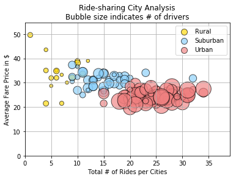
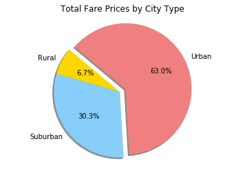
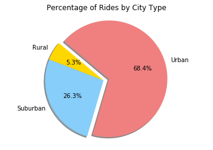

```python
#Colleen Karnas-Haines
#3/19/2018
#Uber Analysis
```
#Observations:
#1. Rural areas, unsurprisingly, have the fewest drivers and 
#the lowest number of rides, but the prices tend to be higher.
#This may be due to the fact that driving distances may be farther or
#the low supply of drivers increases the demand and therefore cost of
#ride-sharing
#2.The most money made from ride-sharing is in urban areas. This is most likely
#due to the larger amount of rides, as the previous chart showed average
#prices tend to be higher in rural areas.
#3. The data is rather consistant when looking at total # of drivers, total 
# number of rides, and total money made from fares. Urban leads, Suburban
#follows, and Rural brings up the rear.

```python
#Dependencies
import matplotlib.pyplot as plt
import pandas as pd
import numpy as np
import os

import seaborn as sns

```


```python
#read in the two csv files
csvpath=os.path.join("raw_data","city_data.csv")
city_data=pd.read_csv(csvpath)

csvpath=os.path.join("raw_data","ride_data.csv")
ride_data=pd.read_csv(csvpath)
```


```python
#check the data
#drop cities that are duplicated
city_data.drop_duplicates(subset=["city"], keep='first', inplace=True)

#city_data.head()
#city_data.count()
```


```python
#Check the data
#ride_data.head()
#ride_data.count()
```


```python
total_data = pd.merge( ride_data,city_data, on="city", how="left")
#total_data.head()
```


```python
#Calculate the number of rides per city and make it a new column in the total_data set
rides=pd.DataFrame(total_data["city"].value_counts())
#total_data.head()
rides.reset_index(level=0, inplace=True)
rides=rides.rename(columns={"index": "city", "city": "num_rides"})
total_data=pd.merge(total_data,rides, on="city")
#total_data.head()
```


```python
#Calculate the average price of a ride in each city and make it a new column in the total_data set
average_fare=pd.DataFrame(total_data.groupby("city")["fare"].mean())
average_fare.reset_index(level=0, inplace=True)
average_fare=average_fare.rename(columns={"index": "city","fare":"avg_fare"})
total_data=pd.merge(total_data,average_fare, on="city")
#total_data.head()
#average_fare.head()
```


```python
#Create a data set that only has city summary data
summary_data=pd.DataFrame(total_data.groupby("city").mean())
summary_data.reset_index(level=0, inplace=True)
summary_data=summary_data.rename(columns={"index": "city"})
simple=total_data.filter(["city","type"], axis=1)
#simple.groupby("city").head()
simple=simple.drop_duplicates(subset="city", keep='first', inplace=False)
summary_data=pd.merge(summary_data,simple, on="city", how="inner")
#summary_data.head()

```


```python
#This looks great, but I cannot get the markers to change size. The instructions ask for a seaborn, but...
#sns.lmplot('avg_fare', 'driver_count', data=summary_data,scatter_kws={"s": 100},hue="type",fit_reg=False)
#plt.show()
```


```python
#Create a bubble chart using the city summary data
fig, ax = plt.subplots()
groups = summary_data.groupby('type')
colors = ["gold", "lightskyblue","lightcoral"]
for i, (name, group) in enumerate(groups):
    group.plot(kind='scatter', x="num_rides", y='avg_fare', edgecolors="black",alpha=.65, s=group['driver_count']*10, label=name, ax=ax, color=colors[i])
lgd = ax.legend(numpoints=1)
ax.grid(b=True, which='major')
for handle in lgd.legendHandles:
    handle.set_sizes([100.0])
ax.set_ylim((0, max(summary_data["avg_fare"]+5)))
ax.set_xlim((0, max(summary_data["num_rides"]+5)))
plt.xlabel("Total # of Rides per Cities")
plt.ylabel("Average Fare Price in $")
plt.title("Ride-sharing City Analysis\nBubble size indicates # of drivers")
#size relatef to number of drivers
 
plt.show()

```





```python
#Create a pie chart based on the ride data, fare price per city type
fare_type_data=pd.DataFrame(total_data.groupby("type").sum())
# Labels for the sections of our pie chart
labels = ["Rural", "Suburban", "Urban"]

# The values of each section of the pie chart
sizes = fare_type_data["fare"]

# The colors of each section of the pie chart
colors = ["gold", "lightskyblue", "lightcoral"]
explode=[0,0,0.1]

#fare_type_data
```


```python
# Creates the pie chart based upon the values above
# Automatically finds the percentages of each part of the pie chart
plt.pie(sizes, explode=explode, labels=labels, colors=colors,
        autopct="%1.1f%%", shadow=True, startangle=140)
# Tells matplotlib that we want a pie chart with equal axes
plt.axis("equal")
plt.title("Total Fare Prices by City Type")
plt.show()
```





```python
#Create a pie chart based on the ride data, rides by city type
numrides_type_data=pd.DataFrame(total_data.groupby("type").count())

# Labels for the sections of our pie chart
labels = ["Rural", "Suburban","Urban" ]

# The values of each section of the pie chart
sizes = numrides_type_data["num_rides"]

# The colors of each section of the pie chart
colors = ["gold", "lightskyblue", "lightcoral"]
explode=[0,0,0.1]

#numrides_type_data
```


```python
# Creates the pie chart based upon the values above
# Automatically finds the percentages of each part of the pie chart
plt.pie(sizes, explode=explode, labels=labels, colors=colors,
        autopct="%1.1f%%", shadow=True, startangle=140)
# Tells matplotlib that we want a pie chart with equal axes
plt.axis("equal")
plt.title("Percentage of Rides by City Type")
plt.show()
```





```python
#creates a pie chart based on the ride data, drivers by city type
driver_type_data=pd.DataFrame(total_data.groupby("type").count())

# Labels for the sections of our pie chart
labels = ["Rural", "Suburban","Urban" ]

# The values of each section of the pie chart
sizes = driver_type_data["driver_count"]

# The colors of each section of the pie chart
colors = ["gold", "lightskyblue", "lightcoral"]
explode=[0,0,0.1]

#numrides_type_data
```


```python
# Creates the pie chart based upon the values above
# Automatically finds the percentages of each part of the pie chart
plt.pie(sizes, explode=explode, labels=labels, colors=colors,
        autopct="%1.1f%%", shadow=True, startangle=140)
# Tells matplotlib that we want a pie chart with equal axes
plt.axis("equal")
plt.title("Percentage of Drivers by City Type")
plt.show()
```


